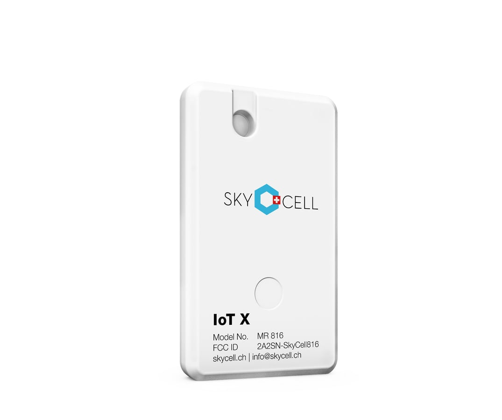

# Laszlo Pataki | Portfolio

A single page portfolio website optimized for senior embedded and IoT engineering roles. Built for fast scanning, ATS compatibility, and high conversion to interviews.

## Live Site

Once deployed: `https://[your-username].github.io/portfolio/`

## Quick Start: Deploy to GitHub Pages

### Step 1: Create GitHub Repository

1. Go to [github.com/new](https://github.com/new)
2. Name your repository `portfolio` (or any name you prefer)
3. Set visibility to **Public** (required for free GitHub Pages)
4. Do NOT initialize with README (you already have files)
5. Click **Create repository**

### Step 2: Push Your Code

Open a terminal in the portfolio folder and run:

```bash
git remote add origin https://github.com/YOUR_USERNAME/portfolio.git
git branch -M main
git push -u origin main
```

Replace `YOUR_USERNAME` with your actual GitHub username.

### Step 3: Enable GitHub Pages

1. Go to your repository on GitHub
2. Click **Settings** tab
3. Scroll down to **Pages** in the left sidebar
4. Under **Source**, select **Deploy from a branch**
5. Under **Branch**, select `main` and folder `/` (root)
6. Click **Save**

### Step 4: Access Your Site

Your site will be live in 1 to 2 minutes at:
```
https://YOUR_USERNAME.github.io/portfolio/
```

## Customization Checklist

Before publishing, update these placeholders in [index.html](index.html):

### Contact Information
- [ ] Replace `laszlo@example.com` with your real email
- [ ] Replace `linkedin.com/in/laszlopataki` with your LinkedIn URL
- [ ] Update location if different from London, UK

### Metrics (Yellow Placeholders)
Replace all `[X...]` placeholders with real numbers:

**SkyCell Project:**
- [ ] Fleet size (e.g., "5,000+ devices")
- [ ] Countries deployed
- [ ] OTA success rate percentage
- [ ] Battery life improvement percentage

**Essensys Project:**
- [ ] Number of sites shipped to
- [ ] Months to ship
- [ ] Bug reduction percentage
- [ ] Number of product variants enabled

**ATE Project:**
- [ ] Test time reduction percentage
- [ ] Defect escape improvement
- [ ] Number of product lines using patterns

**Low Power Project:**
- [ ] Original battery life
- [ ] New battery life
- [ ] Data delivery rate maintained

### Tips for Metrics

If you do not have exact numbers, use honest estimates:
- "Reduced test time by approximately 40%"
- "Fleet of several thousand devices"
- "Deployed across 10+ countries"

Avoid vague language like "significantly improved" without context.

## Assets Folder Plan

Create an `/assets` folder to store:

```
portfolio/
├── index.html
├── README.md
├── assets/
│   ├── Laszlo_Pataki_CV.pdf      # Your current CV (move here)
│   ├── profile.jpg                # Optional: Professional headshot
│   ├── skycell.jpg               # SkyCell product photo
│   ├── essensys.jpg              # Essensys product photo
│   ├── switchee.jpg              # Switchee thermostat photo
│   └── gartenzwerg.jpg           # Gartenzwerg garden photo
```

### Adding Product Images

Each case study card has a placeholder showing where to add an image. To add product photos:

1. Find or take photos of the products you worked on
2. Save them to the assets folder with the names shown in the placeholders
3. Replace the placeholder divs in index.html:

**From:**
```html
<div class="card-img-placeholder">Add product image: assets/skycell.jpg</div>
```

**To:**
```html

```

**Image Tips:**
- Use landscape orientation (roughly 3:2 or 16:9)
- Keep file sizes under 200KB for fast loading
- Product photos from company websites are usually fine for portfolio use
- If no product photo exists, you can delete the placeholder line entirely

To add your CV:
1. The assets folder already exists
2. The download button already points to `assets/Laszlo_Pataki_CV.pdf`

## File Structure

```
portfolio/
├── index.html          # Single page site (HTML + CSS + minimal JS)
├── README.md           # This file
├── Laszlo_Pataki_CV.pdf # Your CV (move to /assets later)
└── assets/             # Create this folder
    ├── Laszlo_Pataki_CV.pdf
    └── profile.jpg     # Optional
```

## Design Decisions

**Why single HTML file?**
- Zero build steps
- Instant GitHub Pages deployment
- Easy to maintain and update
- Fast loading (no external requests except fonts)

**Why dark theme?**
- Modern appearance for tech roles
- Easier on eyes for recruiters reviewing many portfolios
- Distinctive without being unprofessional

**Why this structure?**
- Hero with positioning statement hits first
- Case studies prove claims with Problem/Role/Outcomes structure
- Skills bucketed to match job description keywords
- Contact section with clear CTAs

## SEO and ATS Notes

The page includes:
- Semantic HTML structure
- Meta description with keywords
- Open Graph tags for LinkedIn sharing
- Keyword rich content in natural language
- No JavaScript required for content (progressive enhancement only)

## Local Development

To preview locally, open `index.html` in any browser. No server required.

For live reload during editing:
```bash
npx live-server
```

## Updating Content

1. Edit `index.html` directly
2. Commit and push to GitHub
3. GitHub Pages auto deploys in 1 to 2 minutes

## License

Content is personal. Code structure is free to use.

## Questions?

Open an issue or contact via the links on the portfolio page.